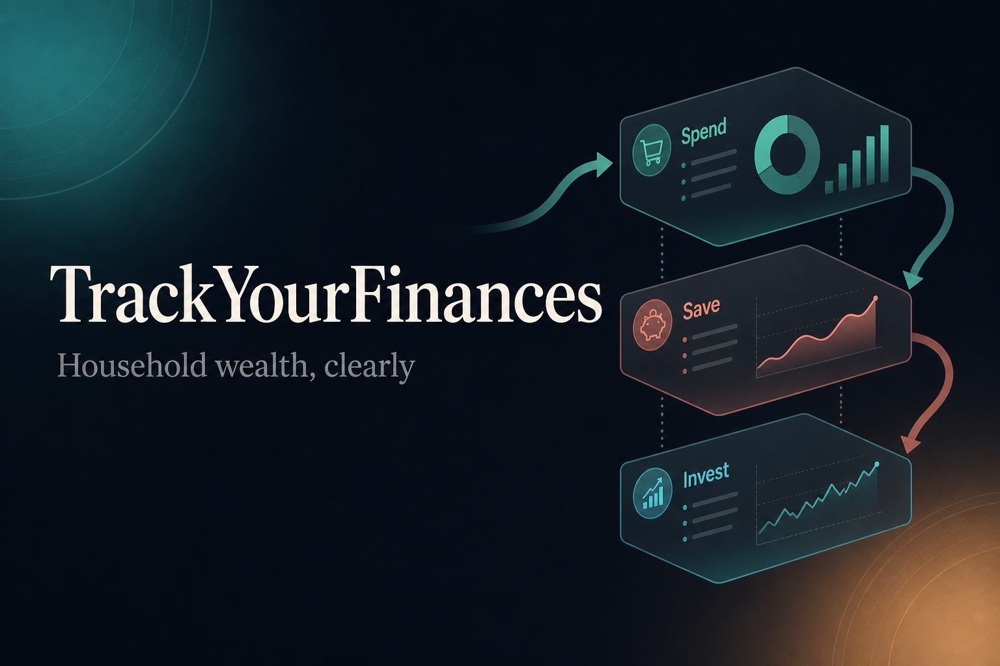
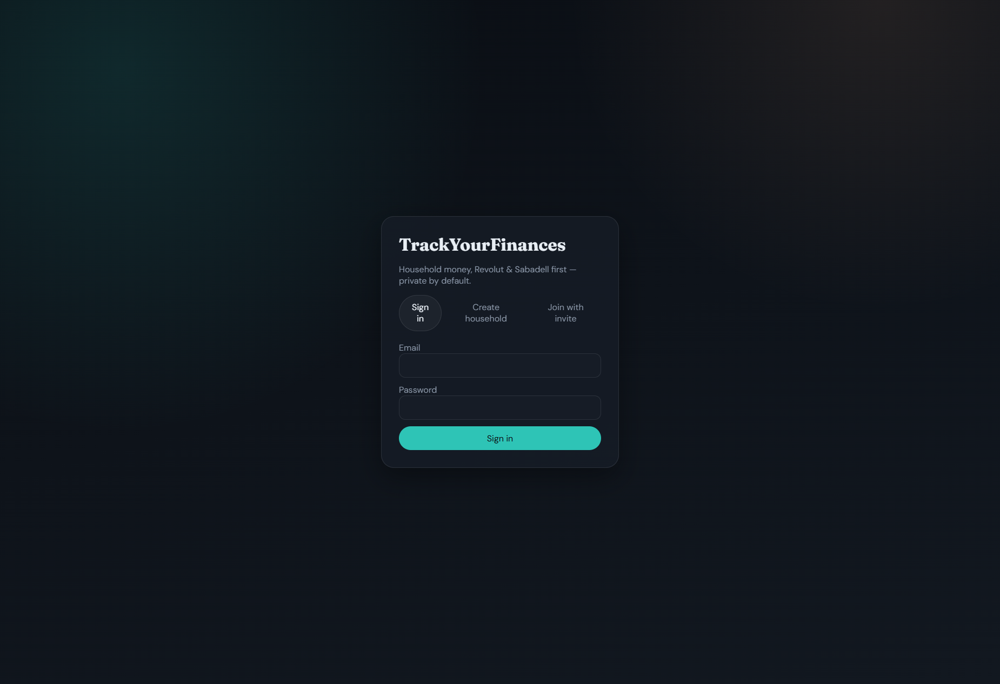
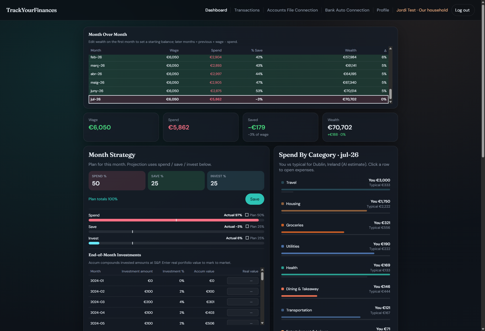
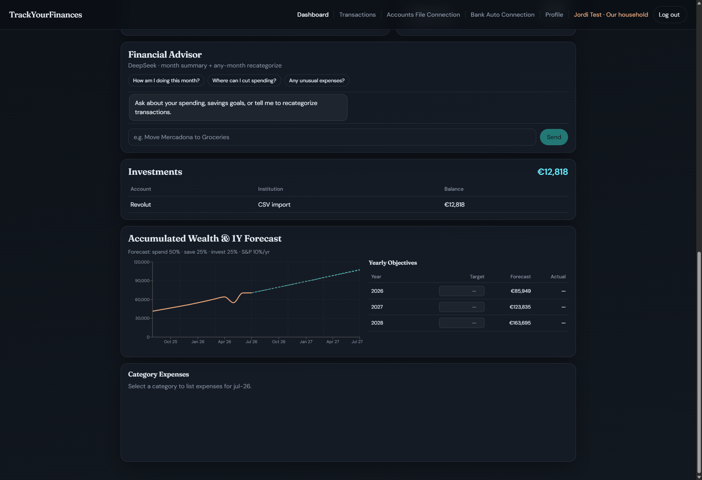
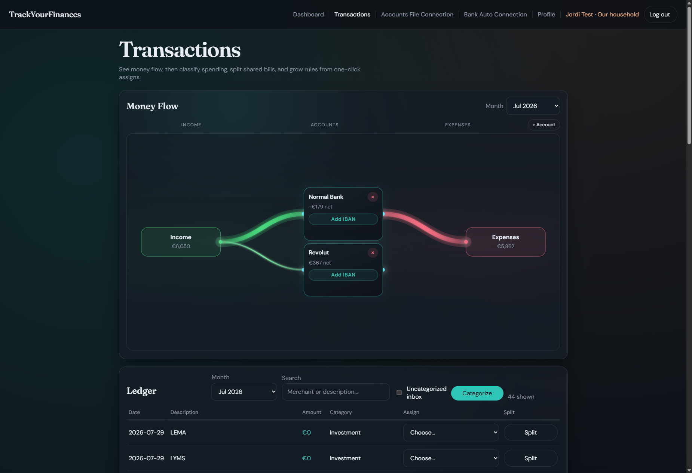
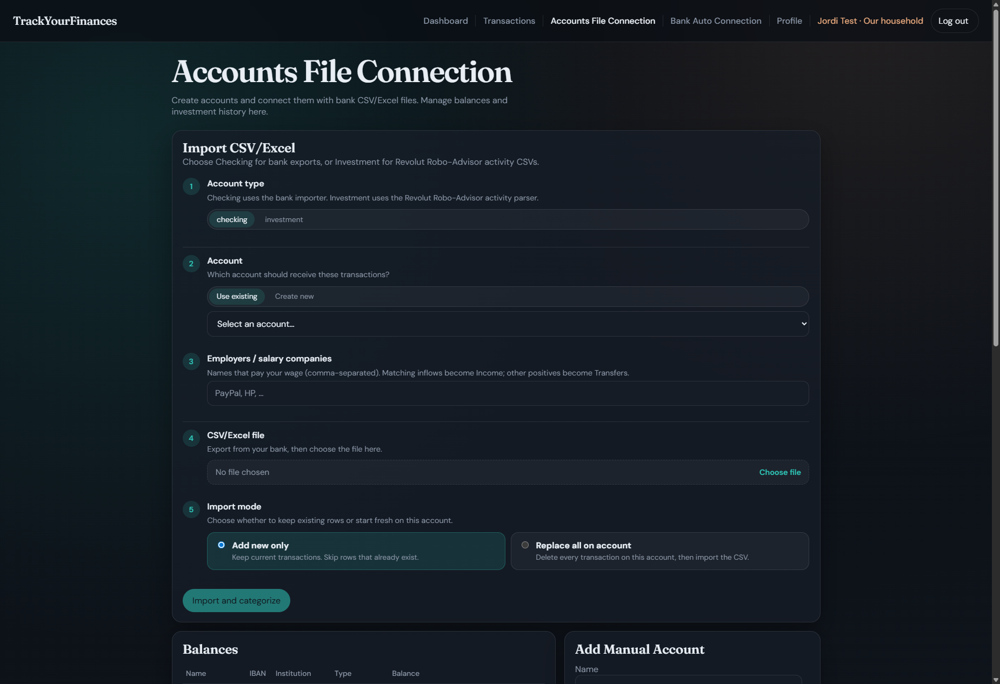
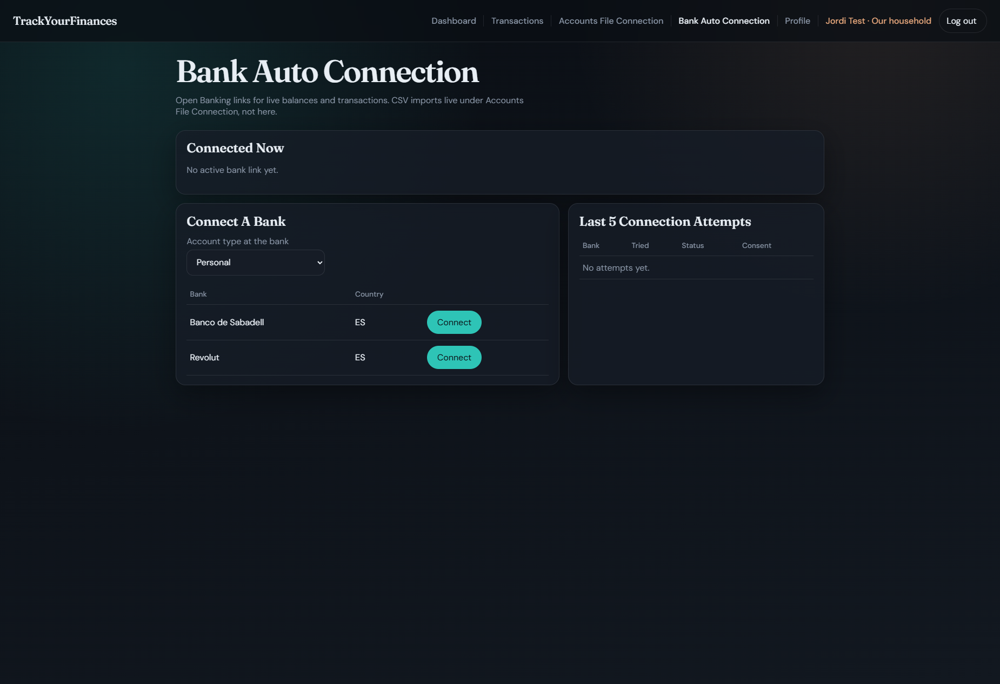
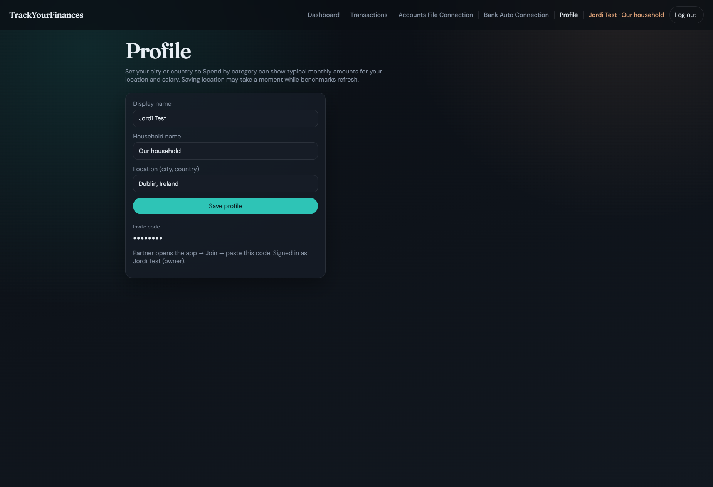
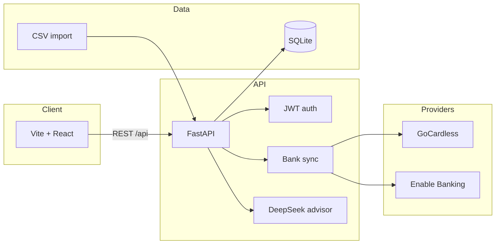

<p align="center">
  
</p>

<h1 align="center">TrackYourFinances</h1>

<p align="center">
  <strong>Private household finance tracker</strong> for European banks — balances, cashflow, and AI-assisted insights in one place.
</p>

<p align="center">
  <a href="https://track-your-finances-yoxg.onrender.com/"><strong>Try the live app on Render →</strong></a>
</p>

<p align="center">
  
  
  
  
</p>

---

## Screenshots

Household auth, dashboard planning, money flow, CSV import, Open Banking, and partner invite — captured from the running app.

### Sign in / create household / join

<p align="center">
  
</p>

### Dashboard — month strategy & spend by category

<p align="center">
  
</p>

### Dashboard — advisor, investments & wealth forecast

<p align="center">
  
</p>

### Transactions — money flow & ledger

<p align="center">
  
</p>

### Accounts & CSV / Excel import

<p align="center">
  
</p>

### Bank auto connection

<p align="center">
  
</p>

### Profile & household invite

<p align="center">
  
</p>

---

## Architecture



---

## Quick start

### 1. Backend

```powershell
cd backend
python -m venv .venv
.\.venv\Scripts\Activate.ps1
pip install -r requirements.txt
copy .env.example .env
.\.venv\Scripts\python.exe -m uvicorn app.main:app --reload --host 127.0.0.1 --port 8001
```

API · [http://127.0.0.1:8001](http://127.0.0.1:8001) · Docs · [http://127.0.0.1:8001/docs](http://127.0.0.1:8001/docs)

### 2. Frontend

```powershell
cd frontend
npm install
npx vite --host 127.0.0.1 --port 5174
```

App · [http://127.0.0.1:5174](http://127.0.0.1:5174) — register a household, then invite your partner from **Household**.

---

## Configuration

Copy `backend/.env.example` → `backend/.env` and fill only what you need.

| Variable | Purpose |
|---|---|
| `SECRET_KEY` | JWT signing secret — use a long random string in any real deploy |
| `ENV` | `development` (local) or `production` (Render). Production refuses default secrets and hides `/docs` |
| `CORS_ORIGINS` | Comma-separated allowed origins. On Render, set to your public `https://….onrender.com` URL |
| `BANK_PROVIDER` | `gocardless` (default) or `enable_banking` |
| `GC_SECRET_ID` / `GC_SECRET_KEY` | GoCardless Bank Account Data credentials |
| `ENABLE_BANKING_APP_ID` / `ENABLE_BANKING_PRIVATE_KEY_PATH` | Enable Banking app + local PEM path |
| `DEEPSEEK_API` | Optional — powers advisor chat & smarter CSV mapping |

### Bank connection (GoCardless)

1. Sign up at [bankaccountdata.gocardless.com](https://bankaccountdata.gocardless.com/) and create `secret_id` / `secret_key`.
2. Put them in `backend/.env`:

```env
BANK_PROVIDER=gocardless
BANK_COUNTRY=ES
GC_SECRET_ID=your_secret_id
GC_SECRET_KEY=your_secret_key
GC_REDIRECT_URL=http://127.0.0.1:8001/api/banking/callback
```

Without GC keys, **Banks → Connect** uses a mock consent flow so you can still develop the UI.

For Enable Banking, set `BANK_PROVIDER=enable_banking` and the `ENABLE_BANKING_*` vars. Keep the PEM under `backend/keys/` (gitignored).

### CSV import

Use `backend/sample_transactions.csv` on **Transactions**.

Supported headers: `date` / `Fecha`, `amount` / `Importe`, `description` / `Concepto`, `merchant`, `external_id`.

### Sync CLI

```powershell
cd backend
.\.venv\Scripts\python.exe sync_cli.py
```

---

## Security (before you go public)

This repo is set up so **real credentials stay on your machine**:

| Path | Status |
|---|---|
| `backend/.env` | gitignored |
| `backend/keys/*.pem` | gitignored |
| `backend/data/*.db` | gitignored |
| `backend/.env.example` | safe placeholders only |

**Do not commit** API keys, private keys, or your SQLite database. Before publishing:

1. Confirm `git status` never lists `.env`, `*.pem`, or `*.db`
2. Rotate any key that ever lived in a committed file or chat history
3. Keep `SECRET_KEY` unique per environment

---

## Deploy on Render (free)

The repo includes a Docker image and [`render.yaml`](render.yaml) Blueprint that runs FastAPI + the built React app as one **free** web service.

1. Push this repo to GitHub and open [Render Blueprints](https://dashboard.render.com/blueprints).
2. Connect the repo and apply the Blueprint (`track-your-finances`).
3. Set **`CORS_ORIGINS`** to your public URL, e.g. `https://track-your-finances.onrender.com` (same value after the first deploy once the hostname is known).
4. Optional: set `DEEPSEEK_API` and bank provider secrets. For live banks, set redirect URLs to `https://<your-service>.onrender.com/api/banking/callback`.
5. Open the service URL — visitors register their own household (JWT + bcrypt).

**Free-tier tradeoffs:** the instance sleeps after idle time (first request can be slow), and SQLite lives on ephemeral disk — accounts/data are wiped on redeploy or when the free instance is recycled. Fine for demos; not for keeping real household history.

Local Docker smoke test:

```powershell
docker build -t track-your-finances .
docker run --rm -p 8000:8000 -e SECRET_KEY=local-docker-secret-change-me -e CORS_ORIGINS=http://127.0.0.1:8000 track-your-finances
```

Then open [http://127.0.0.1:8000](http://127.0.0.1:8000).

---

## Features

1. Household auth + invite code for a partner
2. Manual accounts / balance snapshots (brokers, crypto, cash)
3. CSV import + category assign (creates rules)
4. Bank connect via GoCardless or Enable Banking
5. Dashboard: net worth, spend %, save/invest targets, wealth charts
6. Optional DeepSeek advisor over your household transactions

---

<p align="center">
  <sub>Built for couples and households who want clarity without giving up privacy.</sub>
</p>
