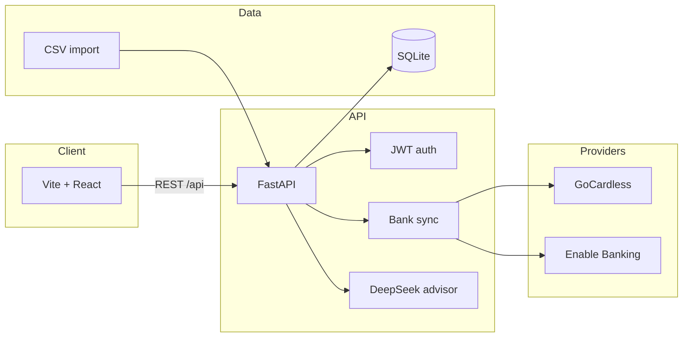

<p align="center">
  
</p>

<h1 align="center">TrackYourFinances</h1>

<p align="center">
  <strong>Private household finance tracker</strong> for European banks — balances, cashflow, and AI-assisted insights in one place.
</p>

<p align="center">
  
  
  
</p>

---

## What you get

| | | |
|:---:|:---:|:---:|
| **🏠 Household** | **🏦 Banks** | **📊 Dashboard** |
| Shared household + invite code for your partner | Connect via GoCardless or Enable Banking | Net worth, spend %, save/invest targets |
| **📥 Imports** | **🤖 Advisor** | **📈 Wealth** |
| CSV import with smart column mapping | DeepSeek-powered chat over your transactions | Charts for cashflow and allocation |

```text
  ┌─────────────┐     ┌──────────────┐     ┌─────────────────┐
  │   Banks /   │────▶│   FastAPI    │────▶│  React dashboard │
  │  CSV files  │     │  + SQLite    │     │  + advisor chat  │
  └─────────────┘     └──────────────┘     └─────────────────┘
         │                    │
         │                    ▼
         │            ┌──────────────┐
         └───────────▶│  Categories  │
                      │  + rules     │
                      └──────────────┘
```

---

## Architecture



---

## Quick start

### 1. Backend

```powershell
cd backend
python -m venv .venv
.\.venv\Scripts\Activate.ps1
pip install -r requirements.txt
copy .env.example .env
.\.venv\Scripts\python.exe -m uvicorn app.main:app --reload --host 127.0.0.1 --port 8001
```

API · [http://127.0.0.1:8001](http://127.0.0.1:8001) · Docs · [http://127.0.0.1:8001/docs](http://127.0.0.1:8001/docs)

### 2. Frontend

```powershell
cd frontend
npm install
npx vite --host 127.0.0.1 --port 5174
```

App · [http://127.0.0.1:5174](http://127.0.0.1:5174) — register a household, then invite your partner from **Household**.

---

## Configuration

Copy `backend/.env.example` → `backend/.env` and fill only what you need.

| Variable | Purpose |
|---|---|
| `SECRET_KEY` | JWT signing secret — use a long random string in any real deploy |
| `BANK_PROVIDER` | `gocardless` (default) or `enable_banking` |
| `GC_SECRET_ID` / `GC_SECRET_KEY` | GoCardless Bank Account Data credentials |
| `ENABLE_BANKING_APP_ID` / `ENABLE_BANKING_PRIVATE_KEY_PATH` | Enable Banking app + local PEM path |
| `DEEPSEEK_API` | Optional — powers advisor chat & smarter CSV mapping |

### Bank connection (GoCardless)

1. Sign up at [bankaccountdata.gocardless.com](https://bankaccountdata.gocardless.com/) and create `secret_id` / `secret_key`.
2. Put them in `backend/.env`:

```env
BANK_PROVIDER=gocardless
BANK_COUNTRY=ES
GC_SECRET_ID=your_secret_id
GC_SECRET_KEY=your_secret_key
GC_REDIRECT_URL=http://127.0.0.1:8001/api/banking/callback
```

Without GC keys, **Banks → Connect** uses a mock consent flow so you can still develop the UI.

For Enable Banking, set `BANK_PROVIDER=enable_banking` and the `ENABLE_BANKING_*` vars. Keep the PEM under `backend/keys/` (gitignored).

### CSV import

Use `backend/sample_transactions.csv` on **Transactions**.

Supported headers: `date` / `Fecha`, `amount` / `Importe`, `description` / `Concepto`, `merchant`, `external_id`.

### Sync CLI

```powershell
cd backend
.\.venv\Scripts\python.exe sync_cli.py
```

---

## Security (before you go public)

This repo is set up so **real credentials stay on your machine**:

| Path | Status |
|---|---|
| `backend/.env` | gitignored |
| `backend/keys/*.pem` | gitignored |
| `backend/data/*.db` | gitignored |
| `backend/.env.example` | safe placeholders only |

**Do not commit** API keys, private keys, or your SQLite database. Before publishing:

1. Confirm `git status` never lists `.env`, `*.pem`, or `*.db`
2. Rotate any key that ever lived in a committed file or chat history
3. Keep `SECRET_KEY` unique per environment

---

## Features

1. Household auth + invite code for a partner
2. Manual accounts / balance snapshots (brokers, crypto, cash)
3. CSV import + category assign (creates rules)
4. Bank connect via GoCardless or Enable Banking
5. Dashboard: net worth, spend %, save/invest targets, wealth charts
6. Optional DeepSeek advisor over your household transactions

---

<p align="center">
  <sub>Built for couples and households who want clarity without giving up privacy.</sub>
</p>
